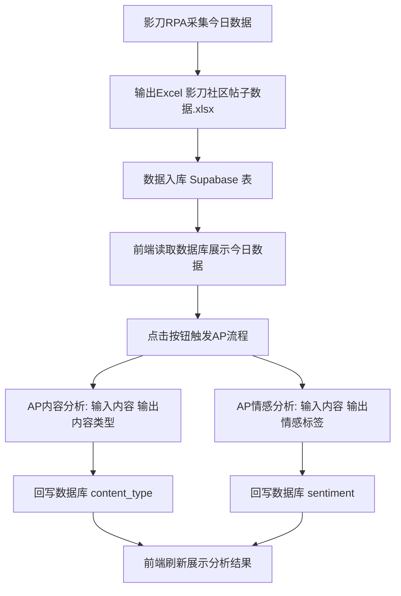

# 社区侦探项目流程梳理（RPA → AP → 数据库 → 前端）

## 目标
- 影刀RPA抓取今日数据并输出 Excel
- 前端可查看今日数据
- 触发 AP 流程进行内容类型、情感分析
- 分析结果回传数据库
- 前端读取并展示分析结果

## 数据对象与字段
- 原始数据：影刀RPA输出 Excel  
  - 文件：`d:\新训\第一周\社区侦探项目\影刀社区帖子数据.xlsx`
  - 字段示例：帖子标题、帖子链接、帖子ID、作者、作者个人页链接、帖子内容（文本）、发布时间、浏览量信息
- AI标签结果：AP 输出
  - 内容类型（content_type）
  - 情感标签（sentiment）

## 流程分解（端到端）
1. **影刀RPA采集**
   - 抓取“今日新增帖子数据”
   - 输出到 Excel：`影刀社区帖子数据.xlsx`

2. **数据入库（数据库）**
   - 将 Excel 入库到数据库表（如：`影刀社区帖子`）
   - 只包含原始字段，不包含 AI 标签

3. **前端查看今日数据**
   - 前端查询数据库中的“今日数据”
   - 展示：趋势、Top榜、作者贡献度
   - AI 标签区域显示“待分析”

4. **触发 AP 流程（内容类型分析）**
   - 输入：文章内容（content）
   - 输出：内容类型（content_type）

5. **触发 AP 流程（情感分析）**
   - 输入：文章内容（content）
   - 输出：情感标签（sentiment）

6. **回写数据库**
   - 将 AP 结果回写到数据库同一行
   - 回写字段：content_type、sentiment

7. **前端展示分析结果**
   - 前端重新读取数据库
   - 展示内容类型分布、情感分布、AI洞察结果

## 执行约束与注意事项
- AP 必须支持批量调用或按条调用
- 回写时使用帖子ID作为唯一键
- 前端应区分“今日数据”与“全量数据”
- 前端需支持按钮触发分析，避免自动消耗 AP 额度

## AP 接入规范（文本情感分析）
### 接口信息
- URL：`https://power-api.yingdao.com/oapi/power/v1/rest/flow/4aad96bc-b721-4475-90b4-46a7d6e6f6d8/execute`
- Header：
  - Authorization: Bearer {AP_TOKEN}
  - Content-Type: application/json

### 请求格式
```json
{
  "input": {
    "input_text_0": "文章内容"
  }
}
```

### 回写字段
- sentiment：情感标签
- ai_status：done/failed
- ai_updated_at：时间戳

### 推荐调用方式
- 不在前端直连 AP
- 通过后端/函数转发请求并回写数据库

## AP 接入规范（内容类型分析）
### 接口信息
- URL：`https://power-api.yingdao.com/oapi/power/v1/rest/flow/dd093840-4bac-4af8-afc0-23d8ac46f666/execute`
- Header：
  - Authorization: Bearer {AP_TOKEN}
  - Content-Type: application/json

### 请求格式
```json
{
  "input": {
    "input_text_0": "文章内容"
  }
}
```

### 回写字段
- content_type：内容类型
- ai_status：done/failed
- ai_updated_at：时间戳

### 推荐调用方式
- 不在前端直连 AP
- 通过后端/函数转发请求并回写数据库

## 数据库字段补充（用于AI结果）
```sql
alter table "影刀社区帖子"
add column if not exists content_type text,
add column if not exists sentiment text,
add column if not exists ai_status text,
add column if not exists ai_updated_at timestamp;
```

## Edge Function 接入（推荐）
### 作用
- 前端只调用 Edge Function
- Edge Function 负责调用 AP（带 AP_TOKEN）并回写数据库（用 Service Role Key）

### 函数
- 函数名：analyze
- 源码位置：[index.ts](file:///d:/新训/第一周/社区侦探项目/supabase/functions/analyze/index.ts)

### 环境变量（在 Supabase 中配置）
- AP_TOKEN
- AP_CONTENT_URL（可选，不配则使用默认URL）
- AP_SENTIMENT_URL（可选，不配则使用默认URL）
- POSTS_TABLE（可选，默认：影刀社区帖子）

### 说明（非常重要）
- Supabase 控制台不允许手动新增 `SUPABASE_` 前缀的 Secret
- `SUPABASE_URL`、`SUPABASE_SERVICE_ROLE_KEY` 由平台内置注入给 Edge Function
- 所以你只需要手动配置 AP 相关变量即可

### 前端调用方式（示例）
```js
const { data, error } = await supabase.functions.invoke("analyze", {
  body: {
    mode: "sentiment",
    post_ids: ["928184990070910976"],
    only_missing: true,
    limit: 200
  }
})
```

## Netlify Functions 接入（当前方案）
### 函数
- 函数名：analyze
- 源码位置：[analyze.js](file:///d:/新训/第一周/社区侦探项目/netlify/functions/analyze.js)
- 路由：
  - `/.netlify/functions/analyze`
  - `/api/analyze`（通过 [netlify.toml](file:///d:/新训/第一周/社区侦探项目/netlify.toml) 转发）

### 环境变量（在 Netlify Site Settings -> Environment Variables）
- SUPABASE_URL
- SUPABASE_SERVICE_ROLE_KEY
- AP_TOKEN
- AP_CONTENT_URL（可选）
- AP_SENTIMENT_URL（可选）
- POSTS_TABLE（可选，默认：影刀社区帖子）
- NETLIFY_ANALYZE_KEY（可选，建议配置）

### 前端调用方式（示例）
```js
await fetch("/api/analyze", {
  method: "POST",
  headers: {
    "Content-Type": "application/json",
    "x-analyze-key": "你的NETLIFY_ANALYZE_KEY"
  },
  body: JSON.stringify({
    mode: "sentiment",
    post_ids: ["928184990070910976"],
    only_missing: true,
    limit: 200
  })
})
```

---

## 流程图（Mermaid）

